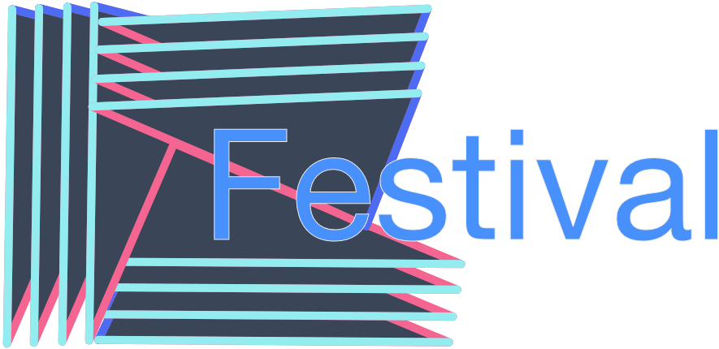
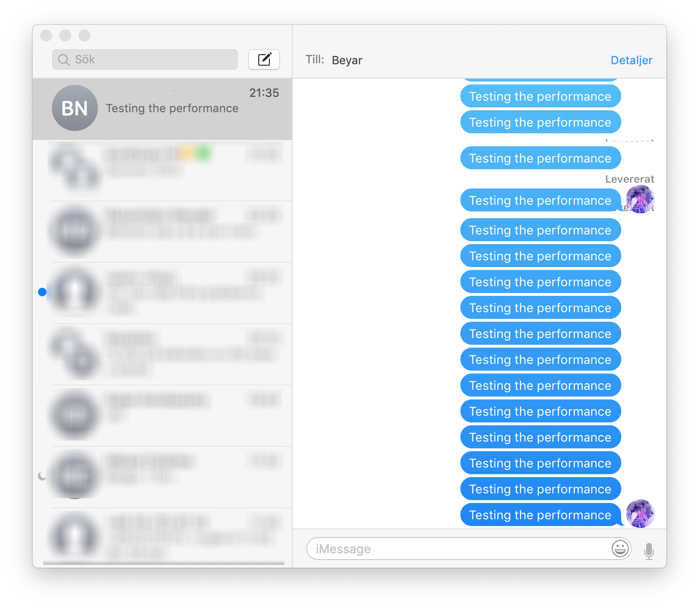
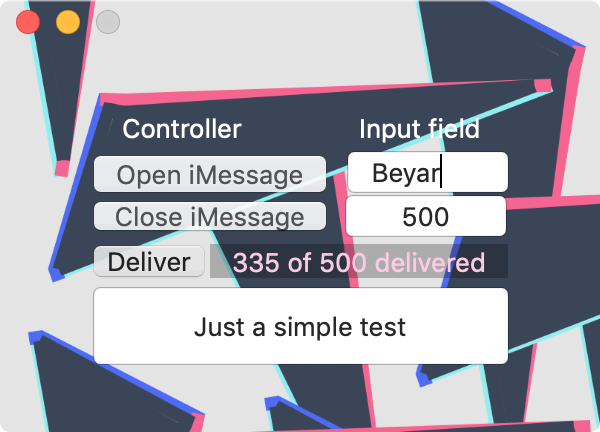

Festival is an application built for macOS only.
It is heavily inspired by Partytime.
My goal was the create a similar app that would have the same purpose but with my own touch to it.
Of course I could just contribute to their project but I wouldn't learn that much from it,
creating my own version from scratch without looking at how they did it would be a huge challenge.
At the end of the day, it was totally worth it!

The only thing Festival differs from Partytime is the status bar,
it is able to display the current status, some of them includes
* Unkown contact
* Not a number
* Amount of messages delivered
* Not a contact
* Permissions success
* Permissions required

### Download
The app can be found [here](product/festivalApp.zip)

### Swift edition
The Swift edition of this project can be found [here](https://github.com/devmaximilian/Festival.app)

###### Known Issues
`[default] Unable to load Info.plist exceptions (eGPUOverrides)`  
This issue is not directly from the app project itself, this issue is from a bug on Mojave.

###### Demonstration
 

###### License
Festival is licensed under the [WTFPL](LICENSE) license, version 2.
```
DO WHAT THE FUCK YOU WANT TO PUBLIC LICENSE
Version 2, December 2004

Copyright (C) 2018 Beyarz

Everyone is permitted to copy and distribute verbatim or modified
copies of this license document, and changing it is allowed as long
as the name is changed.

DO WHAT THE FUCK YOU WANT TO PUBLIC LICENSE
TERMS AND CONDITIONS FOR COPYING, DISTRIBUTION AND MODIFICATION

0. You just DO WHAT THE FUCK YOU WANT TO.
```
